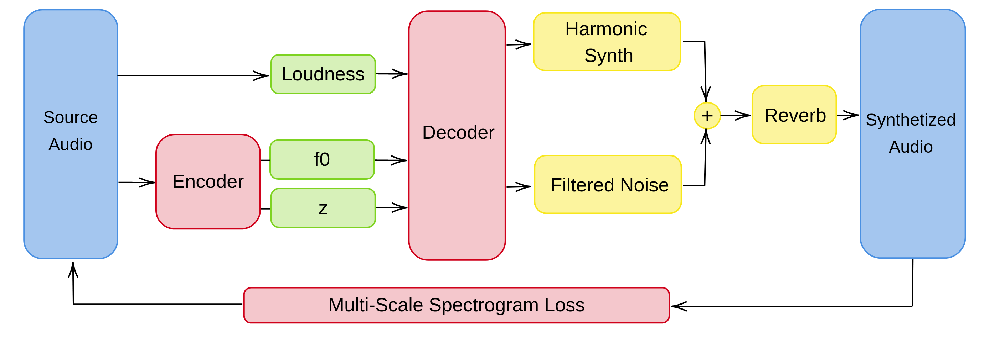
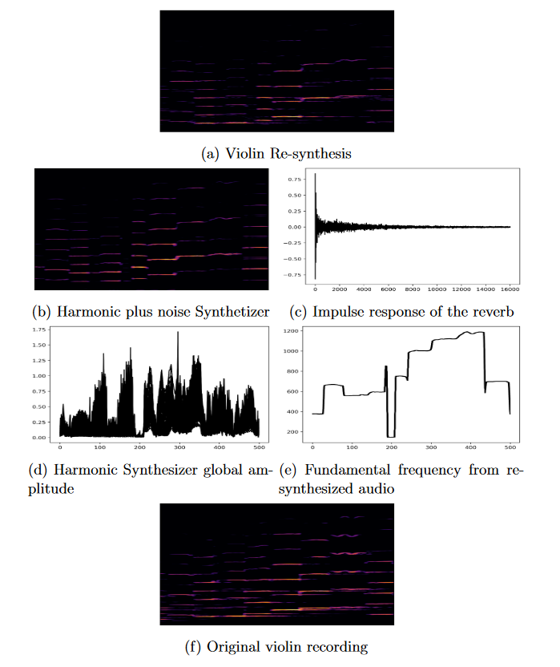
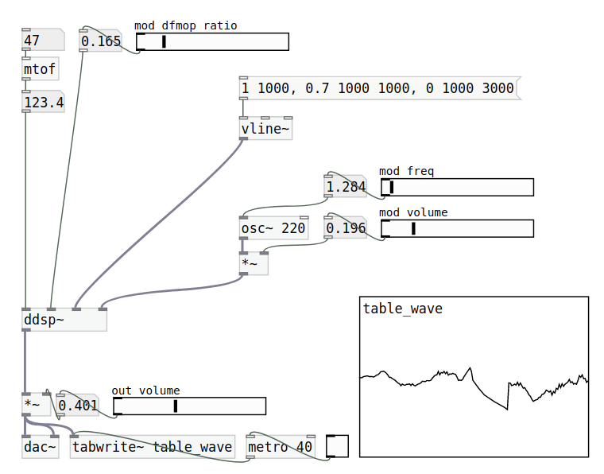

# ddsp-real-time

**THIS REPOSITORY IS IN RE-DEVELOPMENT DUE TO PROPRIETARY FEATURES AND PARTS DEVELOPED DURING AN INTERNSHIP.**

DDSP stand for Differentiable Digital Signal Processing, this repository is an implementation of this model using PyTorch and Juce in order to produce a simple and real-time acoustic timbre transfer.

> [DDSP: Differentiable Digital Signal Processing](https://arxiv.org/abs/2001.04643) 
> Jesse Engel, Lamtharn Hantrakul, Chenjie Gu, Adam Roberts. 
> International Conference on Learning Representations (ICLR), 2020.

#### Model presentation

Differentiable Digital Signal Processing or DDSP is a new approach brought by Jesse Engel et al. [1]. The DDSP paradigm lies between waveGAN [2] and the PresetGen [3] generative model. Indeed the DDSP architecture does not directly compute the waveform but predicts the controls of its embedded synthesizer. This synthesizer part allows the gradient to pass through it.

In the original publication, it is proposed to use a harmonic synthesizer, a reverberation module and filtered noise for the reconstruction of the signal reproducing a harmonic plus noise synthesizer [4]. The objective here is to learn the amplitudes of the harmonics and the noise filter as a function of a fundamental frequency and a loudness detected upstream of the auto-encoder network. 

#### Signal Path

Deconstruction of a re-synthesized audio sample, Audio is visualized using spectrogram, Loudness and fundamental frequency signals are extracted from the original violin recording. Amplitude.

#### Instrument transfer
The instrument transfer is carried out from an auto-encoder trained to reproduce an instrument. The transfer takes place by abstraction of the original instrument through its loudness ***l***, its fundamental frequency ***f0*** and its spectral content ***z***.

- Original saxophone sample (from the P.Glass Saxophone Solos)
<audio src="assets/sax_original.wav"></audio>

- Saxophone transfered into a violin (16kHz // 16bits)

<audio src="assets/sax_to_violin_transfert.wav"></audio>

#### DDSP in a Pure data external

The real-time implementation of the DDSP was performed in the Pure Data environment [5]. The interface between the PyTorch model and the DDSP has been realized using the TorchScript method. 

#### References

[1] Jesse Engel, Lamtharn Hantrakul, Chenjie Gu, and Adam Roberts. DDSP: Differentiable digital signal processing. arXiv preprint arXiv:2001.04643, 2020.

[2] DONAHUE, Chris, MCAULEY, Julian, et PUCKETTE, Miller. Adversarial audio synthesis. *arXiv preprint arXiv:1802.04208*, 2018.

[3] TATAR, Kıvanç, MACRET, Matthieu, et PASQUIER, Philippe. Automatic synthesizer preset generation with presetgen. *Journal of New Music Research*, 2016, vol. 45, no 2, p. 124-144.

[4] Xavier Serra and Julius Smith.  Spectral modeling synthesis:  A sound analysis/synthesis system based on a deterministic plus stochastic decomposition. Computer Music Journal, 14(4):12–24, 1990.

[5] Miller S Puckette et al. Pure data. InICMC, 1997.

## Licence

- MIT
